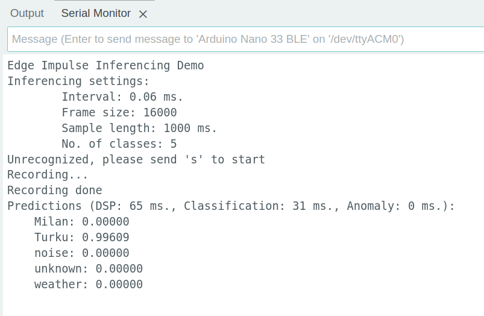
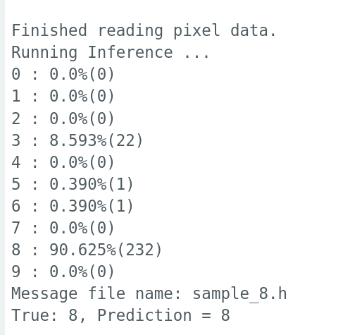

# Edge Impulse keyword-spotting project

link to the project latest version: https://studio.edgeimpulse.com/public/397501/live

Deployed Arduino Library (.zip) and the code snippet (.ino) for testing can be found in `./keyword_spotting_mfcc_ver_3/`

## How to deploy the example:
Arduino IDE (v.1.18 or above) 
If you don’t have it, please install the IDE following the instructions [here](https://support.arduino.cc/hc/en-us/articles/360019833020-Download-and-install-Arduino-IDE)

Install the [deployed Arduino Library](./keyword_spotting_mfcc_ver_3/ei-minh_nguy3n-project-1-v3-arduino-1.0.9.zip) in Sketch > Include Library > Add .ZIP Library...

Compile and Upload the [Arduino script](./keyword_spotting_mfcc_ver_3/keyword_spotting_mfcc_ver_3.ino) to the Arduino Nano 33 Sense. Once uploaded, open the Serial Monitor window (baudrate **115200**) and send key *s* to as input, the model interpreter will invoke the inference, which will have the output some thing like shown below.
 

# TFLite MNIST project

## Goal
Given a full-precision TensorFlow model, the goal of this project is to transform the model for the Arduino Nano 33 BLE sense and run inferences directly on the board without using sophisticated development platforms like Edge Impulse. We will be using Arduino IDE for this project. 

## How to run the deployment
Similarly, use Arduino IDE to open the project located in `TFLite_MNIST`.

In this directory, we defined the headers files:
- `MNIST_quantized_int8_test.h` include the exported serialized model
- `model_setting.h` include globals variables which include specifications of the model input and output
- `sample_x.h` are the conversions in gray-scale (unsigned 8-bit compatible) from the input samples hand-drawn digits.

After compiling of the [Arduino .ino script](./TFLite_MNIST/TFLite_MNIST.ino), upload to the Arduino Nano 33 board. Open the Serial monitor window to view the results of the inferences on the samples data, which will print each image inference every 5 seconds.

Example output from running inference on data of `sample_8.h`:

 

 

## Answers to Questions

*Q1: Will using a camera sensor (like OV7670) make the acquisition of data more complex? Tell us what you think will change (and what won’t) compared to what we do here very briefly*

**Answer**: No, the data acquisition is simplified since the camera module can resample the pixel's RGB data into 8-bit grayscale and set the resolution with their Arduino Library, thus the images may not need further pre-processing. For normalization, in the context of this MNIST project, we can iterate over the image's pixels and divide the value by 255.

*Q2: How did you decide to transform the set of images for running inferences later? Does the flash memory limitation of the board affect your decision?*

**Answer**: The images pixel matrix should be resized to 28x28, converted to gray-scale, resampled to floating values between 0 and 1 (divided by 255), and flattened to an 1-dimensional array before running on TFlite model. The size of flash memory on Arduino dictate our decision with the input image dimension, since we would like to make sure that all images could fit in the deployed version on the board (in ./TFlite_MNIST).

*Q3: How did you decide to prune the model graph? Was it useful and were there any trade-offs?*

**Answer**: The model was pruned using the Polynomial decay technique, with the begin from 50% and end with 80% pruning rate. It compressed the model by 3x but we suspected that we could have lost some high-valued weights somewhere in the middle of the training cycle and the model might have lost its accuracy on a few corner cases (as reported, the accuracy of pruned model on ds_test is 98.57%, while that of the base model is 98.81%)

*Q4: What quantization mechanism did you use? How did the fact that the model needs to run on the Arduino Nano influence your decision?*

**Answer**: We used full-integer quantization (i.e., the input and output tensor of the tflite are `uint8_t`). This model would support 8-bit computation. Although the Arduino Nano board has a Arm® Cortex®-M4F processor (with Floating-point Unit), it should be noted here that the image pixels are of type 8-bit unsigned (0-255 gray scale). Therefore, full-interger quantization is the most suitable for this model.

*Q5: Was both pruning and quantization necessary for the task? Could we have skipped either or both and still been able to use the model?*

**Answer**: We could have used only quantization to compress the model. However, the size of the exported .tflite model would be doubled. Considering the fact that we want to optimize for size and latency running on the Arduino Nano, combining Pruning and quantization is neccessary.

*Q6: Is the output vector in your program same as running the tflite model in Python?*

**Answer**: The output tensor vector is an uint8_t array of length 10, which is similar to the one running from the Python script. One difference is the sum of all elements, in the Arduino's version it is 255, while in Python script, it is 256.

*Q7: How did the model perform on the test images?*

**Answer**: In the previous version, our samples (hand-drawn digit), digit 8 and 6 got misclassified by the quantized model, which we suspect that is because the sampled data is was drawn with thiner stroke than the ones the model was trained with. However, after we modified the model training parameters of LeNet-5 (following the tutorial by [Saif](https://www.educative.io/blog/lenet-5)), the quantized model can accurately predict our sample images.

